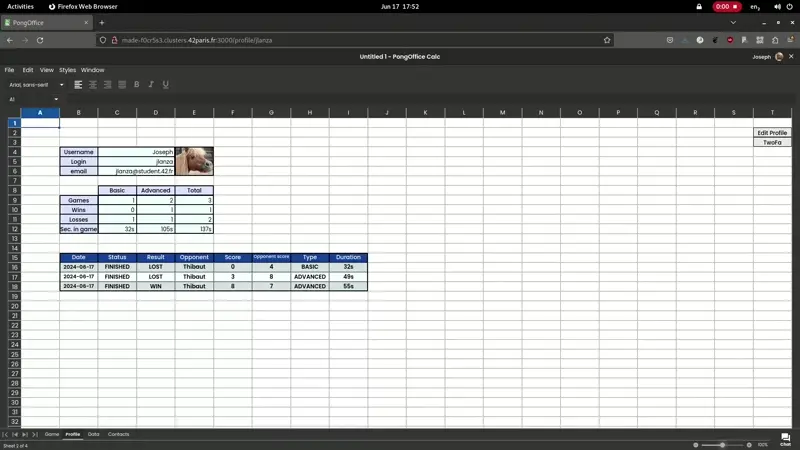

# ft_transcendence

A website for the mighty Pong contest



## Overview

Our website is a online multiplayer Pong hidden in a LibreOffice Calc page to play at work undetected. There is a chat and real-time multiplayer online games!

### TechStack
- Backend written in NestJS
- Frontend written with React
- PostgreSQL database
- Single-page application

### Game
The main purpose of this website is to play Pong versus other players.
- Matchmaking system: the user can join a queue until they get
automatically matched with someone else
- Default version of the game
- Advanced version with multiple balls and graphs with hitbox
- The game is responsive!

### Athentification
- Password are hashed
- Protected against SQL injections
- The user must login using the OAuth system of 42 intranet
- The user is able to choose a unique name that will be displayed on the
website
- The user is able to upload an avatar
- Two-factor authentication. For instance, Google Authenticator or sending a text message to their phone
- The user is able to add other users as friends and see their current status
(online, offline, in a game, and so forth)
- Stats (such as: wins and losses, ladder level, achievements, and so forth) are displayed on the user profile
- Each user have a Match History. Anyone who is logged in can consult it

### Chat
- Chat channels (chat rooms) that can be either public, or private, or protected by a password
- Direct messages to other users
- Block other users. This way, they will see no more
messages from the account they blocked
- The user who has created a new channel is automatically set as the channel owner until they leave it
- The channel owner can set a password required to access the channel, change it, and also remove it
- The channel owner is a channel administrator. They can set other users as administrators
- A user who is an administrator of a channel can kick, ban or mute (for a
limited time) other users, but not the channel owners
- Invite other users to play a Pong game through the chat
interface
- Other players profiles visible through the chat interface


## Usage (linux)
Setup .env and :
```console
make
```

## Credits
Created by [mbocquel](https://github.com/mbocquel), [tgrasset](https://github.com/tgrasset), [jlanza](https://github.com/lanzaj), [pjay](https://github.com/Pierrickjay) and [rertzer](https://github.com/rertzer)
